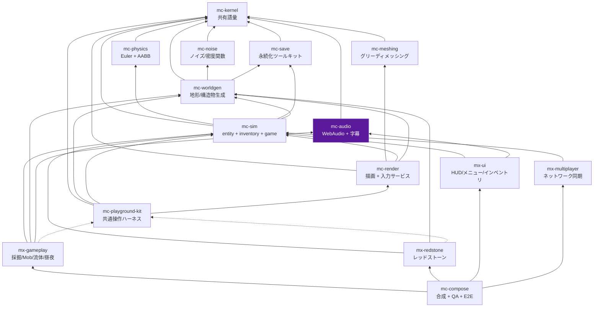
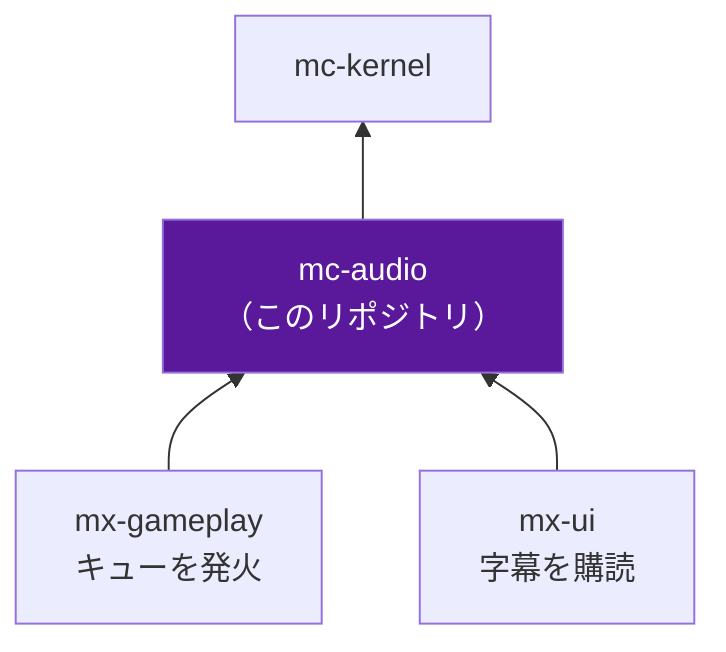

# アーキテクチャ

## 1. 4 階層

plan.md §2.2 の 4 階層。**性質が違うものを同じ階層に置かない**ことが唯一の規律である。

| 階層 | リポジトリ | 性質 |
| --- | --- | --- |
| 安定ライブラリ | kernel / noise / meshing / physics / save / **audio** | 純粋関数・狭い界面・変更頻度が低い。相互独立で並行構築できる |
| 基盤 | worldgen / sim / render / playground-kit | 状態とサービス（**名詞**）。体験モジュールが乗る土台 |
| 体験モジュール | mx-gameplay / mx-redstone / mx-ui / mx-multiplayer | ルールと UI（**動詞**）。互いを知らず、基盤サービス経由でのみ会話する |
| 合成 | mc-compose | Layer マージ + stage 順序表 + E2E。ロジックを持たない |

階層外に `mc-dev-meta`（plan.md §6 Step 0 の開発用 workspace）がある。
これは他リポジトリを clone するだけで、依存はしない。

## 2. 依存グラフ（16 リポジトリ全体）

実線 = 実行時依存 (`dependencies`)、点線 = プレビュー起動時のみ (`devDependencies`)。



このグラフは `scripts/check-dependency-whitelist.ts` の `REPOSITORY_POLICY.dependencyGraph`
に**そのまま**記述されており、CI で機械的に強制される。
図とコードが食い違ったらコードが正である（図のほうを直すこと）。

### 強制されるルール

| ルール | 内容 |
| --- | --- |
| ハード失敗 | 違反があれば CI は非ゼロ終了する。警告で済ませない |
| 循環禁止 | 例外リスト（「co-evolution ペア」等）を設けない |
| **推移閉包の禁止** | A→B、B→C のとき A は C を import できない。依存は直接依存のみが import 許可を意味する |
| kernel は例外 | mc-kernel はどこからでも import 可（ただし `package.json` への記載は必要） |
| 宣言と実体の一致 | import する `@nerima-games/*` は `package.json` に無ければ違反 |
| kit は devDependency 専用 | `dependencies` に入れたら CI fail |
| `Date.now()` 禁止 | 時刻は注入された Clock Port から取得する |

## 3. mc-audio の位置

**安定ライブラリ階層（tier 1）のリーフ。しかも "シンク" である。**

- **親（mc-audio が依存してよいもの）**: `mc-kernel` のみ。
  ホワイトリスト上の直接依存は**空集合**である。
- **子（mc-audio に依存するもの）**: `mx-gameplay`、`mx-ui`。
  gameplay がキューを鳴らし、ui が字幕を購読する。



### 一方通行であることが本質

mc-audio は**押し込まれる側**であり、決して押し返さない。

特に **mc-sim を import してはならない**。
「プレイヤーがどこに居るか知りたいので sim に聞く」は禁止で、呼び出し側が座標を渡す。
この一方通行の規律があるから、mc-audio は DOM 無しの Node で全部テストできる。

`scripts/check-dependency-whitelist.ts` は `mc-sim` の import を
`not-whitelisted` として落とす（`test/dependency-policy.test.ts` に固定済み）。

### DOM を持たないという設計判断

`tsconfig.base.json` の `lib` に `"DOM"` が**入っていない**。
オーディオのリポジトリとしては奇妙に見えるが、これは意図的である。

- 現在出荷している全て（キューレジストリ・音量算術・BGM 状態機械・字幕ストリーム）は純粋である
- `"DOM"` を締め出すことで、WebAudio 固有の部分が `AudioBackendPort` の裏に**強制的に**回る
- 結果として jsdom も `AudioContext` も無しでテストできる

WebAudio アダプタは**最後に書く**。最初ではない。

## 4. 構成ルール（plan.md §2.3）

### 4-1. 基盤 = 名詞、体験 = 動詞

`InventoryService` のような**状態の置き場**は基盤階層に置き、
「掘ったらドロップする」という**ルール**は体験階層に置く。
体験モジュール間の依存エッジはゼロである。

mc-audio はどちらでもない。tier 1 の道具である。

境界線ははっきりしている:

| これは mc-audio | これは mx-gameplay / mx-ui |
| --- | --- |
| 「`blockBreak` を鳴らす」ときの音量計算・空間化・字幕発火 | 「ブロックを壊したら `blockBreak` を鳴らす」というルール |
| BGM の状態機械（day/night/cave のどれを流すか） | 「今が夜かどうか」の判定（sim の TimeService） |
| 字幕イベントの発行と可視リストの算出 | 字幕の DOM 描画 |

### 4-2. mc-playground-kit は devDependency 専用

kit は「ミニ世界 + カメラ + レンダラ + 入力を 1 秒で束ねる糊」であり、プレビュー専用である。
実行時入力サービスを所有するのは **mc-render** であって kit ではない。

kit を `dependencies` に入れると出荷ビルドから入力処理が消える。
`scripts/check-dependency-whitelist.ts` が
`dev-only-package-in-dependencies` として**必ず失敗**させる。

mc-audio は将来サウンドボードプレビュー（plan.md §3.6）を持つが、
それは DOM だけで起動できるので kit を必要としない（mx-ui と同じ理由）。

### 4-3. stage 実行順序表は mc-compose が唯一所有する

各モジュールは `StageRegistration.after` で**順序制約を宣言するだけ**であり、
全順序を解決するのは compose だけである。

標準の骨格（plan.md §4.2）:

```
input → simulation(physics → interactions → entities → fluids → redstone → time/weather)
      → camera-mirror → chunk-sync → render → post-fx → hud-sync
```

mc-audio 自身は frame stage を登録しない。
キューを発火するのは mx-gameplay の stage であり、mc-audio はそこから呼ばれる。

## 5. なぜ 16 に分けたのか

単一リポジトリ (84k LOC) では「正しく動くことが保証される単位」が大きすぎ、
検証しきれなかった。分割の目的は**体験単位ごとに正しさを単独で閉じる**ことである。

mc-audio の完了条件には plan.md §3.6 が
**サウンドボードプレビュー**（全キューを一覧から試聴）を挙げている。
詳細は [testing.md](./testing.md)。
